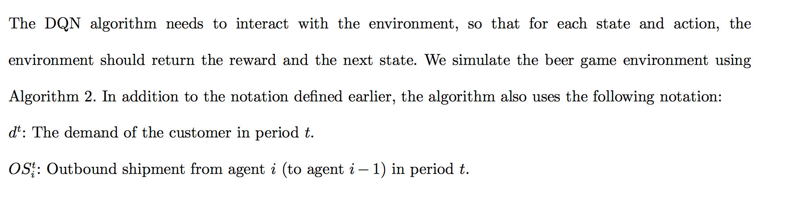
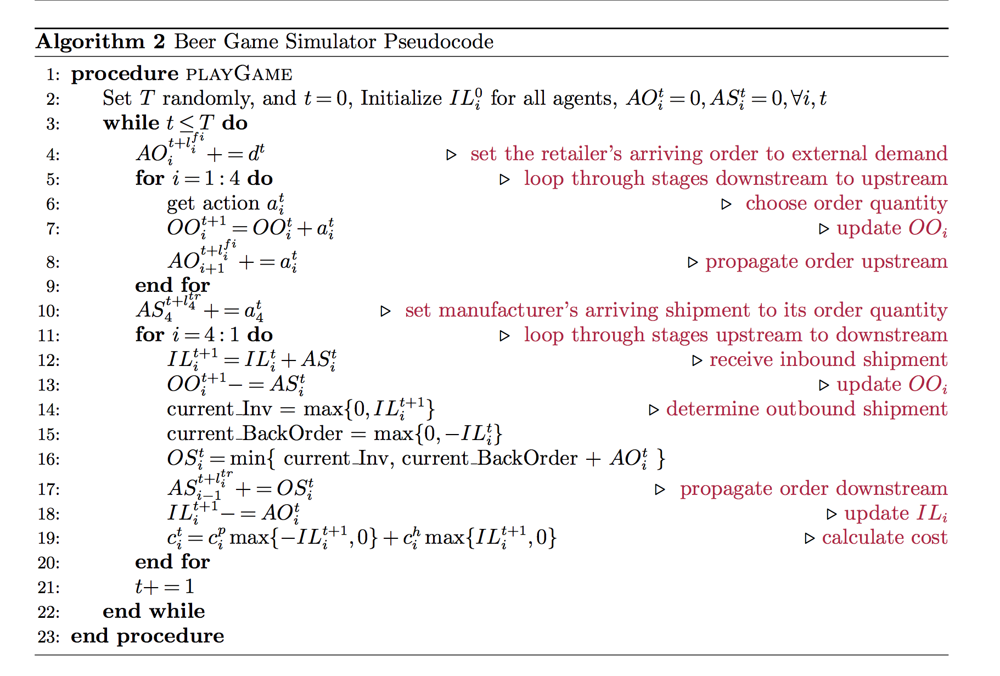

## Beer Game

- beer game （[啤酒游戏](https://wenku.baidu.com/view/d160acc79ec3d5bbfd0a7463.html)）是 一个模拟供应链的简易游戏。

- 啤酒游戏本身比较有趣，可以让初学者明白供应链中每个角色（制造商、经销商、批发商、零售商）之间合作的重要性。

- 每个角色需要是自己以及整个供应链的代价最小。

- 该环境可以从模拟合作博弈.

# beergame
复现beergame

## todo

- [x] 弄清楚beergame的原理

- [x] 弄清楚state的定义

## Q&A

- [x] 大家有什么问题可以写在这里

## References

- [1] [A Deep Q-Network for the Beer Game: Reinforcement Learning for Inventory Optimization](https://arxiv.org/pdf/1708.05924.pdf)

- [2] pesudocode from [1]

