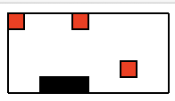

# RLEnv
Reinforcement Learning Env for fun;
模拟gym的使用方式

## Environments

- [snake 贪吃蛇](./snake)

- [kuhn poker 一个简单的两人牌类博弈，可以用来实践Counterfactual Regret Minimization算法](./kuhn_poker)


## 使用方法：

- clone 环境

```

git clone https://github.com/yangmuzhi/RLEnv.git

```

- 在python中导入环境,以贪吃蛇为例

```
from snake_env import Snakes_subsonic

env = Snakes_subsonic()

```

## 效果

- 贪吃蛇



- Kuhn poker 

```
(defaultdict(<function kuhn_poker.kuhn_poker_env.Kuhn_Poker.reset.<locals>.<lambda>()>,
             {0: {'player': 0, 'action': 0, 'value': 0, 'done': False}}),
 False,
 None)
```


## Reference

- An Introduction to Counterfactual Regret Minimization
