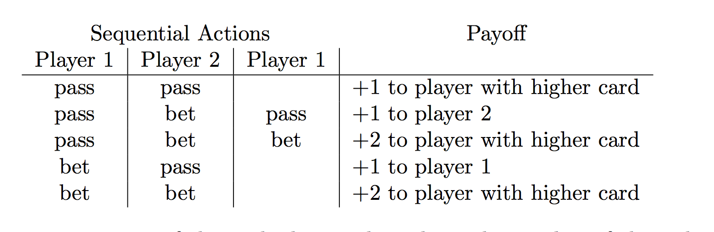

## Kuhn Poker


- kuhn poker是一个两人的纸牌博弈游戏，共有三张牌：1，2，3。游戏开始时每人抽一张牌，并放入一个筹码。然后由player0开始决策，可以选择加注（BET，player0得再放入1一个筹码）或者不加注（PASS，不用放入筹码）。接着player1决策，同样可以选择加注（BET，player1得再放入1一个筹码）或者不加注（PASS）以此类推，根据每个人的决策在第二回合或者第三回合决策流程结束。然后比较每个人的牌的大小，牌大者赢得比赛，拿走奖金池中的全部奖金。游戏结束。

- Kuhn poker 的所有博弈结果



- 使用方法： 详细参考 test_env.py

```{python}
from kuhn_poker.kuhn_poker_env import Kuhn_Poker
import numpy as np
# 实例化
env = Kuhn_Poker()

# 环境重置
api = env.start_play()
next(api)

# 做动作
# player0
api.send(0)

# player1
api.send(1)
```

- 效果  kuhn poker是一个不完全信息博弈，因此每次send之后，会返回一个dict包含该player应该知道的信息。

```
(defaultdict(<function kuhn_poker.kuhn_poker_env.Kuhn_Poker.reset.<locals>.<lambda>()>,
             {0: {'player': 0, 'action': 0, 'value': 0, 'done': False}}),
 False,
 None)
```
