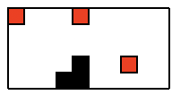
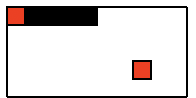

## snake 贪吃蛇


- 使用方法： 详细参考 test_env.py

```{python}
from snake_env import Snakes_subsonic
# 实例化
env = Snakes_subsonic()
# 环境重置
state = env.reset()
# 显示图形
env.render()
# 做动作
action = 0
env.step(action)
```

- 构建： 使用numpy和tKinter(构建图形)


- 效果

  - 

  - 

  - 
